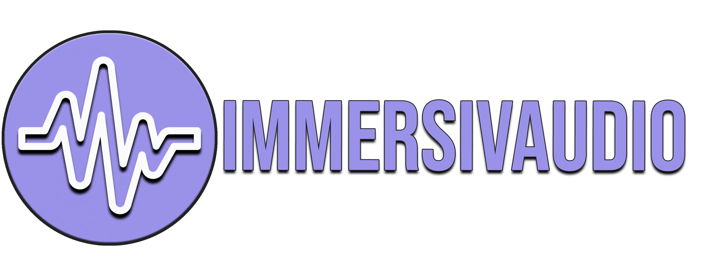

# Immersivaudio

AI Music generation from video and photos content.

## Project Overview

This project is focused on video processing and music generation using AI. The goal is to extract frames from a video, analyze the content of the frames using object detection, generate a description of the frames, and then use that description to generate music. The project uses a combination of computer vision, natural language processing, and music generation techniques to create a unique audio-visual experience.

### Scripts Folder

The Scripts folder contains the main scripts for the project, including the following:

- `audioldm2.py`: This script generates music from a provided prompt
- `best_frame_selection.py`: This script selects the best frame from a collection of frames based on a k-medoids clustering algorithm
- `frame_extractor.py`: This script extracts frames from a video file using a specific formula
- `yolov9.py`: This script performs object detection on a frame using the YOLOv9 model
- `moondream2.py`: This script generates a description from a specific frame
- `gradio_interface.py`: This script creates a Gradio interface for the project
- `prompt_combiner.py`: This script combines the output of the frame description and object detection scripts to generate a prompt for the music generation script
- `video_reconstructor.py`: This script join together the video and the generated music
- `main.py`: This script runs the entire video processing and music generation pipeline 

### Notebooks

The Code folder also contains several Jupyter notebooks (.ipynb files) that demonstrate the usage of the scripts and the overall video processing workflow. They have been dropped in the last commit, but they are still visible in the previous versions of the repository. 

### Usage

`Google Colab`: If you don't have a GPU, you can use Google Colab to run the scripts. Just use the `Immersiveaudio_Colab.ipynb` notebook to run the project in the cloud. More detailed instructions are provided in the report.

`Local Machine`: If you have a high performing GPU with CUDA, you can run the scripts on your local machine. Just make sure you have all the dependencies installed and run the `gradio_interface.py` script to start the Gradio interface.

